# Sequence Diagrams - Web Gallery Sekolah

## 1. User Login Sequence

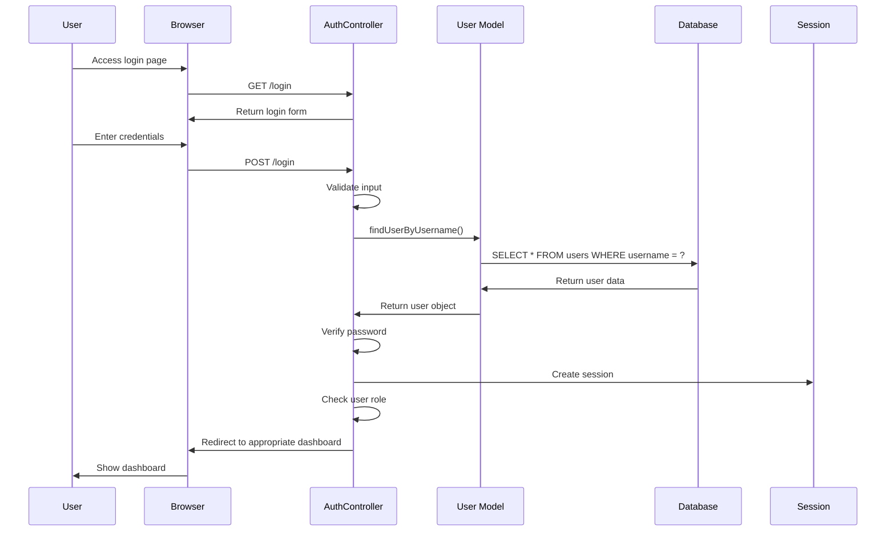

## 2. Photo Upload Sequence

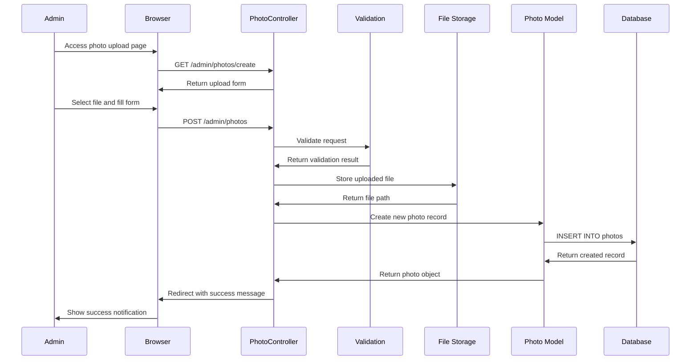

## 3. Gallery View Sequence

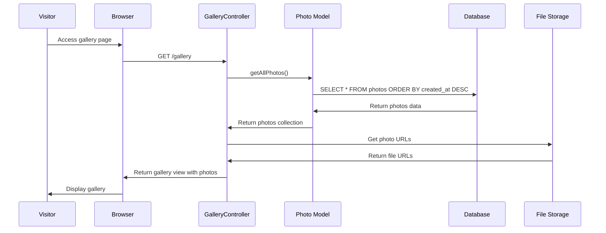

## 4. Information Management Sequence

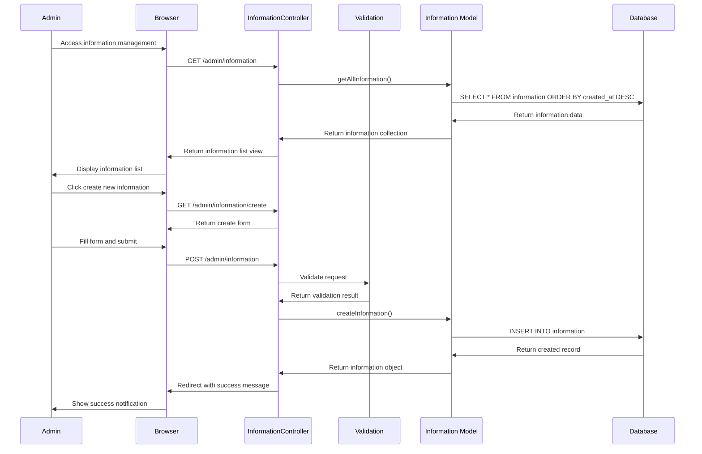

## 5. User Registration Sequence

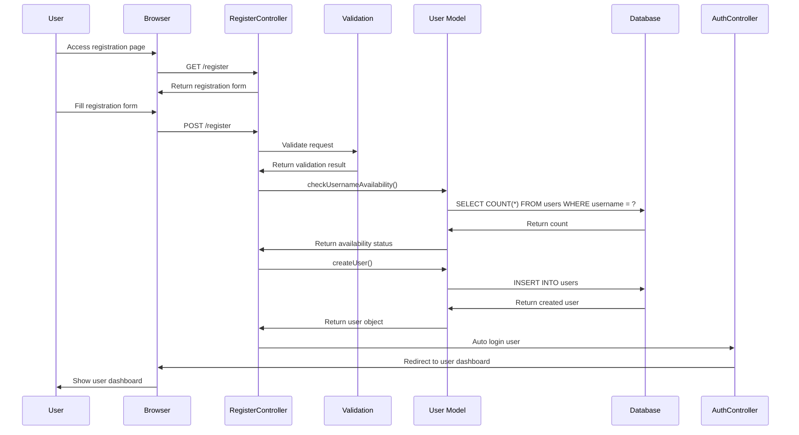

## 6. Photo Search Sequence

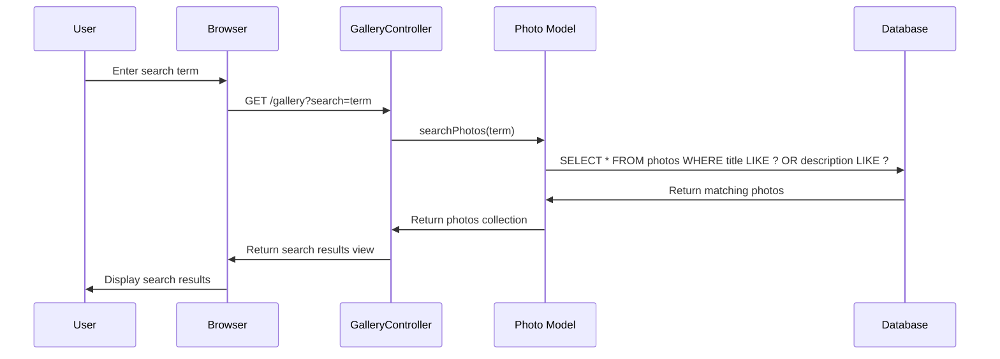

## 7. Category Filter Sequence

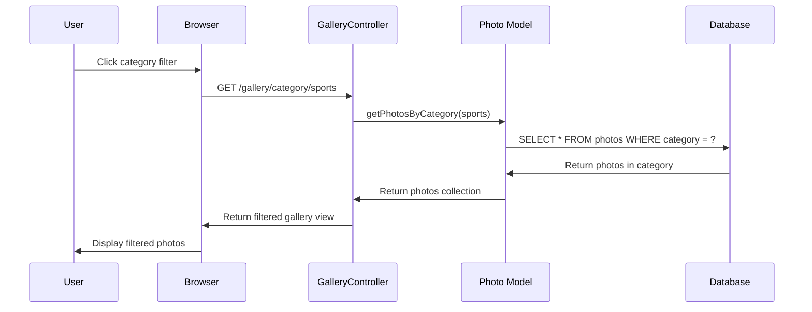

## 8. Information Publishing Sequence

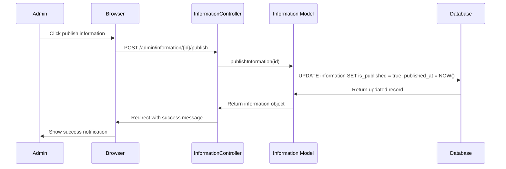

## 9. File Deletion Sequence

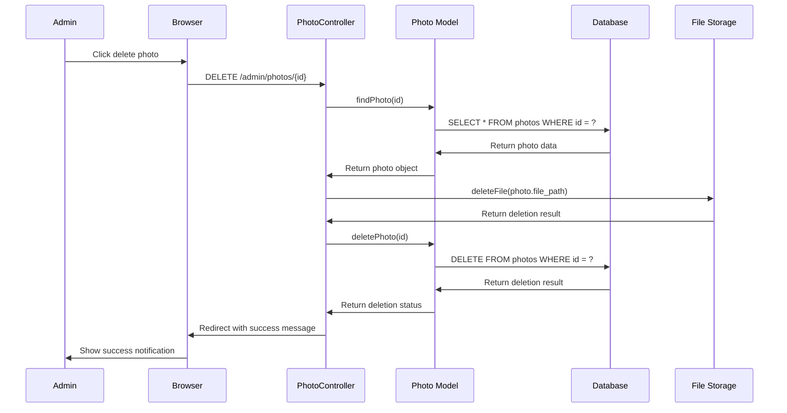

## 10. Dashboard Statistics Sequence

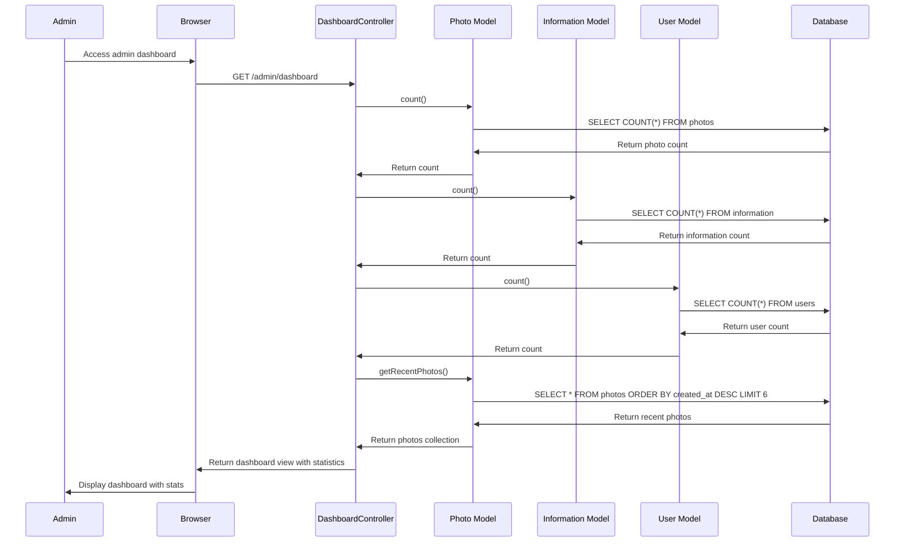

## 11. Error Handling Sequence

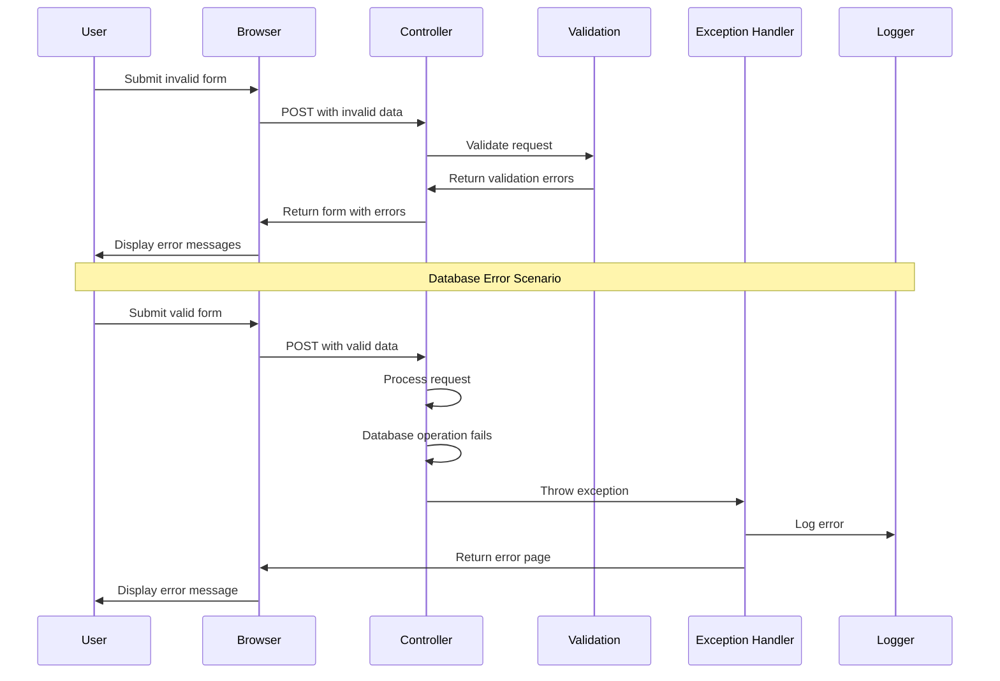

## 12. Authentication Middleware Sequence

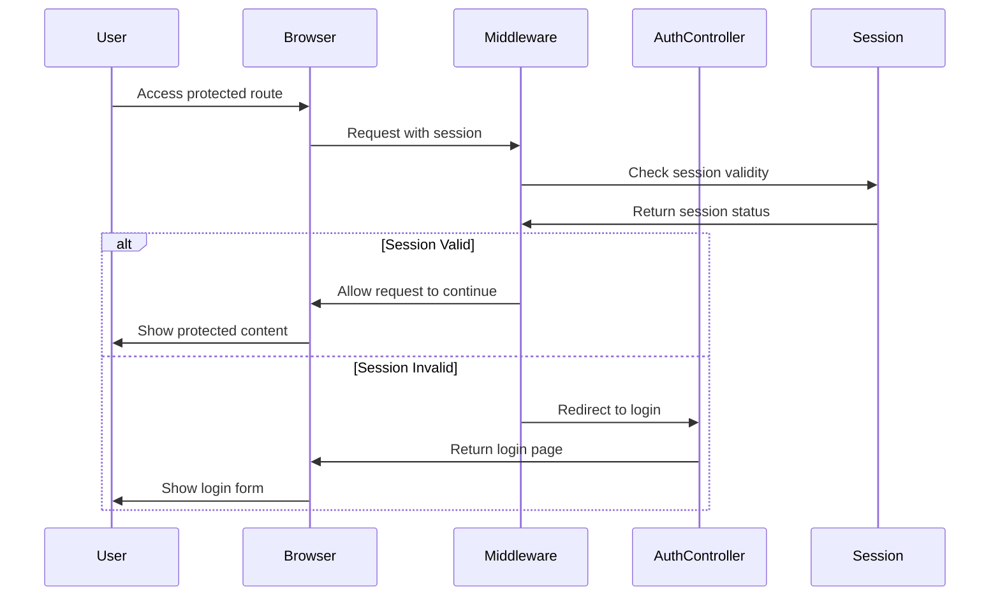
